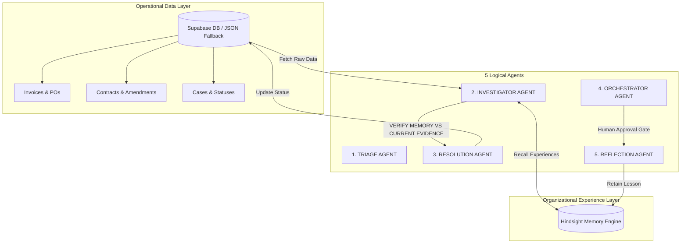

# VAULTY — AI Exception Intelligence

> **Investigate. Resolve. Remember.**

Vaulty is an agentic Accounts Payable (AP) exception intelligence system that investigates invoice discrepancies using business evidence and accumulated organizational experience, resolves what it reasonably can, and learns from every outcome using **Hindsight**.

---

## 🎯 The Core Pitch & Principle

> **"Matching tells you that something is wrong. Vaulty investigates WHY."**

Standard Accounts Payable systems perform basic 3-way matching:
$$\text{Invoice} \longleftrightarrow \text{Purchase Order (PO)} \longleftrightarrow \text{Goods Receipt}$$

When a mismatch occurs, traditional software halts. Humans must spend hours searching for contract amendments, checking vendor histories, emailing buyers, or identifying fraud risks.

Vaulty automates the **investigation, evidence verification, safe resolution, and organizational learning layers**.

### The Central Principle
> **MEMORY MUST CHANGE FUTURE BEHAVIOR.**
> Hindsight is a genuine functional part of the system—not a decorative memory panel.

```
DETECT ──► INVESTIGATE ──► RECALL ──► VERIFY ──► RESOLVE ──► LEARN
```

---

## 🗄️ System Architecture & Data Layer Separation

Vaulty maintains a strict separation of concerns between operational business records and organizational memory:

1. **Supabase (System of Record for Business Data):**
   - Tables: `vendors`, `purchase_orders`, `invoices`, `receipts`, `contracts`, `amendments`, `cases`.
   - Primary data store for operational AP records.
   - Includes graceful fallback to `data/*.json` if Supabase credentials are not configured or unreachable (`Data: Supabase` vs `Data: Local Files`).

2. **Hindsight (Institutional Memory & Experience Layer):**
   - Stores plain-English lessons, reflections, and human feedback.
   - Remains completely separate from business tables to maintain pure experience recall (`Memory: Hindsight` vs `Memory: Local Fallback`).



---

## 🎨 Enterprise UI & Centerpiece Design

Designed specifically for Accounts Payable & Finance professionals with **zero technical jargon**:

- **4 Primary Destinations:**
  1. **My Workspace:** Plain-language headline ("You have N invoices waiting on your decision"), 4 stat tiles, real activity feed.
  2. **Exceptions:** Filterable queue of invoice discrepancies with plain-language issue descriptions and status pills.
  3. **Vendors:** Combined directory and master detail view showing contract terms, banking dates, and vendor-specific Hindsight memories.
  4. **Reports:** 100% real numbers computed live from system records (Auto-resolution rate, total value approved, discrepancy breakdown).

- **THE CENTERPIECE — Memory Influence Panel:**
  - Uses an exclusive **Violet Accent (`#8B5CF6`)** reserved strictly for this component.
  - Structure:
    $$\text{Memory Recalled} \longrightarrow \text{Current Evidence Check} \longrightarrow \text{Plain Verdict}$$
  - Plain verdicts:
    - *"This matches what I expected"* (CONFIRMED)
    - *"This doesn't match what I expected, so I checked further"* (CONTRADICTED)
    - *"No earlier case applied here"* (NOT_APPLICABLE)

---

## ⚡ Demo Scenarios & Simulation Tools

Vaulty includes 5 pre-configured demo scenarios plus a non-scripted custom invoice simulator:

| Case ID | Scenario | Surface Issue | Memory & Evidence Behavior | Final Outcome |
| :--- | :--- | :--- | :--- | :--- |
| **VX-1001** | Clean Invoice | None | Triage verifies consistency | Cleared ➔ Human Gate |
| **VX-2001** | ACME Amendment | ₹550 vs ₹500 PO | Recalls memory, finds active approved amendment AM-17 | Applies amendment ➔ Resolved |
| **VX-2002** | ACME Contradicted | ₹550 vs ₹500 PO | Recalls past ACME amendment lesson BUT current evidence has NO amendment | **Memory Contradicted** ➔ Drafts vendor query |
| **VX-2044** | Human Correction | 100 billed / 80 rec'd | Recalls human correction lesson from VX-1040 warning against auto-close | Requests corrected invoice / holdback |
| **VX-3005** | Fraud Signal | Discrepancy + recent bank update | Detects bank detail update within 48h | **Bypasses Resolution** ➔ Fraud Review |

### Non-Scripted Invoice Simulation
Use **`➕ Simulate an Incoming Invoice`** in the sidebar to create custom invoices on the fly with arbitrary amounts, PO rates, delivery quantities, and banking update flags to verify that Vaulty reasons over live data dynamically.

---

## 🛠️ Database Setup & Migration

### 1. Execute SQL DDL Schema
Run `scripts/schema.sql` in your Supabase SQL Editor to create the tables (`vendors`, `purchase_orders`, `invoices`, `receipts`, `contracts`, `amendments`, `cases`) and enable prototype RLS policies.

### 2. Run One-Time Idempotent Migration
```bash
python scripts/migrate_to_supabase.py
```
This inserts/upserts all records from `data/*.json` into Supabase tables.

---

## 🚀 Installation & Local Execution

```bash
# 1. Install dependencies
pip install -r requirements.txt

# 2. Configure environment variables (Optional: Add SUPABASE_URL, SUPABASE_ANON_KEY, GROQ_API_KEY, HINDSIGHT_API_KEY)
cp .env.example .env

# 3. Launch Streamlit Web Application
streamlit run app.py
```

---

> *"Vaulty doesn't just remember what happened. It remembers what was learned from what happened — and uses that experience the next time."*
